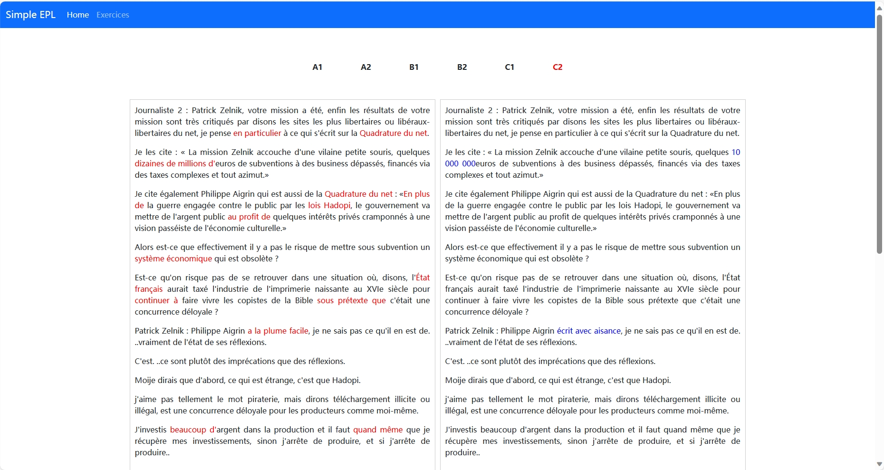
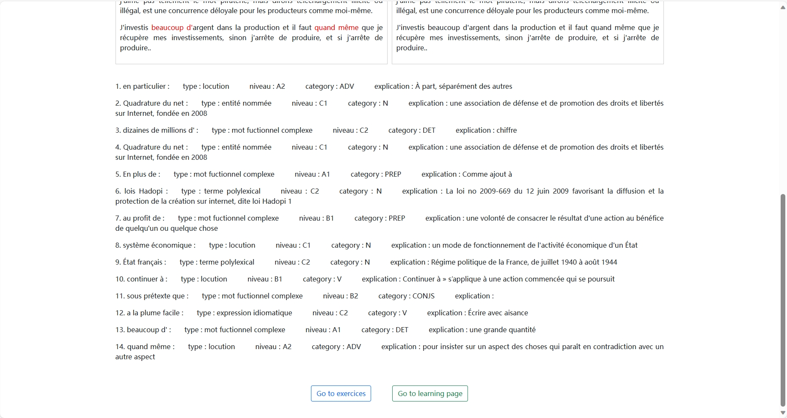
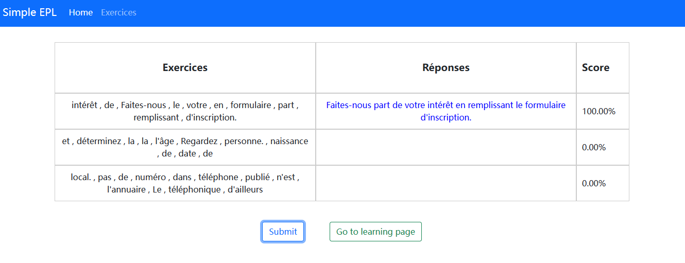

# Simple EPL

Les expressions polylexicales ont la particularité de se manifester ensemble dans une phrase, créant ainsi des constructions linguistiques uniques. Prenons l'exemple de l'expression 'un coup de foudre', qui signifie la manifestation soudaine de l'amour dès la première rencontre. Si un apprenant interprète cette expression de manière littérale, en considérant le terme 'coup de foudre' comme un phénomène météorologique, cela peut entraîner une rupture de la compréhension dans le discours.

Cette tendance des expressions polylexicales à véhiculer un sens global différent de la simple somme de leurs parties constitutives souligne l'importance d'une approche contextuelle dans l'apprentissage du français. Notre projet vise à remédier à cette difficulté en utilisant des outils basés sur le Traitement Automatique du Langage (TAL) et en fournissant des explications contextuelles détaillées pour chaque expression polylexicale. En comprenant le contexte dans lequel ces expressions sont utilisées, les apprenants seront mieux équipés pour saisir leur signification réelle et les intégrer efficacement dans leur expression et compréhension du français au quotidien.


## Dossier

### 1. media

Les fichiers multimédias utilisés dans ce projet, tels que les corpus de textes, les règles de segmentation, etc.

- a1.txt : le texte du niveau a1
- a1.json : les informations obtenues après le traitement du texte
- annotate_text.py : le script pour faire le traitement du texte
- EPL_info.txt : le dictionnaire des informations d'expressions polylexicales
- parser_result.txt : visualisation du parser de grammaire qui aide à analyser le résultat
- rule_segment.txt : les règles de segmentation de tokens
- rule_syntax.txt : les règles de l'analyse de grammaire

### 2. myApp

L'application de DJango

### 3. projetExpression

Les fichiers de configurations

### 4. static

Les fichiers statique qui se composent de deux parties, soit les fichiers de javascript et les fichiers de css

### 5. templates

Les fichiers html pour la mise en page du site web

- base.html : les composants qui sont partagés par tous les pages
- home.html : la page d'acceuil
- exercices.html : la page d'exercices

### 6. venv

L'environnement virtuel


## exécuter localement ce projet

Cloner le project

```bash
  git clone https://github.com/seop-hang/SimpleEPL.git
```

Se rendre dans le répertoire du projet

```bash
  cd SimpleEPL
```

installer les dépendances

```bash
  pip install -r requirements.txt
```

exécuter le serveur

```bash
  python manage.py runserver
```

## captures d'écran




## 🛠 outils
Javascript, HTML, CSS, Django...